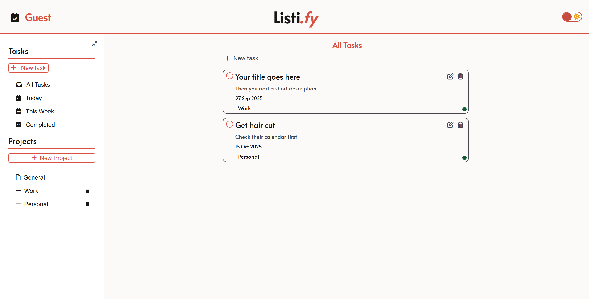
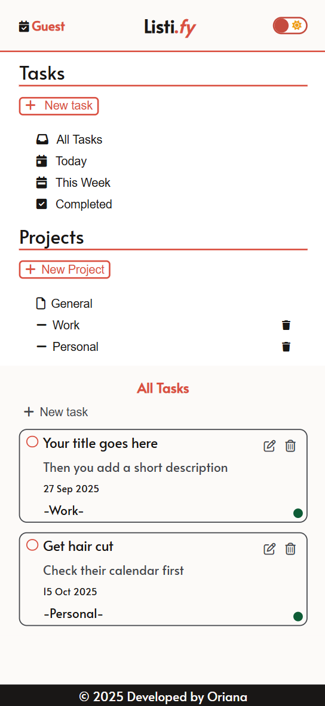

# Listi.Fy - Todo Application

## 🔗 [Live Demo](https://orianaland.github.io/Todo-List/)

## Project Description

Interactive todo-list app built with JavaScript, HTML, and CSS. Tracks tasks with add, edit, delete, and mark-as-complete features. A practice project from The Odin Project to sharpen DOM manipulation and JavaScript skills.

## Key Features

- **Project Organization:** Create multiple projects to organize your todos
- **Priority System:** Mark tasks as High, Medium, or Low priority with visual indicators
- **Smart Categories:** Built-in filters for Today, This Week, and Completed tasks
- **Dark/Light Mode:** Toggle between color themes for comfortable use
- **Responsive Design:** Works seamlessly on desktop and mobile devices
- **Data Persistence:** Todos are saved to localStorage so they persist between sessions
- **Intuitive UI:** Clean, modern interface with smooth animations

## Technologies Used

- **Frontend:** JavaScript (ES6 Modules), HTML5, CSS3
- **Date Handling:** date-fns library for date manipulation and formatting
- **Icons:** Font Awesome for a comprehensive icon set
- **Storage:** Web Storage API (localStorage) for data persistence
- **Build Tool:** Webpack for module bundling

## Project Structure

├── dist/ # Production build
├── src/
│ ├── index.html # Main HTML structure
│ ├── styles.css # All styling with CSS custom properties
│ ├── index.js # Main application entry point
│ ├── todoDOM.js # DOM manipulation and rendering logic
│ ├── todoList.js # Todo and category management logic
│ ├── todoItem.js # Todo class definition
│ ├── categories.js # Category class definition
│ ├──todoStorage.js # localStorage management utilities
├── webpack.config.js # Webpack configuration
└── package.json # Project dependencies

## Architecture

The application follows a modular architecture with clear separation of concerns:

- **Data Layer (todoItem.js, categories.js, todoStorage.js):**
  - Handles todo and category object creation
  - Manages data persistence using localStorage
  - Implements the Web Storage API with proper error handling
- **Business Logic Layer (todoList.js):**
  - Manages todo operations (create, read, update, delete)
  - Handles category management
  - Implements filtering and sorting logic
- **Presentation Layer (todoDOM.js, styles.css):**
  - Renders todos and categories to the DOM
  - Handles user interactions
  - Implements responsive design and animations

## UI/UX Features

- **Visual Priority Indicators:** Color-coded dots (red, yellow, green) for task priority
- **Smooth Transitions:** CSS transitions for all interactive elements
- **Custom Checkboxes:** Styled checkboxes with animation effects
- **Collapsible Sidebar:** Save screen space when needed
- **Modal Dialogs:** Clean forms for adding/editing todos and projects
- **Scrollable Lists:** Handles large numbers of todos efficiently

## Development Notes

This project was an excellent opportunity to:

- Practice JavaScript module patterns and separation of concerns
- Implement factory functions and class-based object creation
- Work with the Web Storage API for data persistence
- Utilize date-fns library for date manipulation and formatting
- Create a responsive design with CSS Grid and Flexbox
- Implement dark/light mode theming with CSS custom properties
- Build accessible modal dialogs and form validation
- Manage complex state transitions between different views
- Implement a collapsible sidebar with smooth animations
- Practice event delegation for efficient DOM handling
- Create a priority system with visual indicators
- Develop a project-based organizational structure for todos
- Implement local storage with proper error handling and data validation

## Screenshots & Gifs

### Desktop View

### Mobile View

### Sidebar & Dark Mode Demo

## Usage

# Creating a Todo

1. Click "New Task" button
2. Fill in the title, description, due date, category, and priority
3. Click "Add to-do" to save

# Managing Projects

1. Click "New Project" in the sidebar
2. Enter a project name (max 15 characters)
3. Todos can be assigned to specific projects

# Organizing Tasks

- Use the sidebar to filter tasks by:
  - **All Tasks:** View everything
  - **Today:** Tasks due today
  - **This Week:** Tasks due this week
  - **Completed:** Finished tasks
  - **Projects:** Filter by specific projects

# Editing and Deleting

- Click the edit icon (pencil) to modify a todo
- Click the trash icon to delete a todo or project
- Check the checkbox to mark a task as complete

## Installation

1. Clone the repository:
   git clone https://github.com/your-username/listify-todo-app.git

2. Navigate to the project directory:
   cd listify-todo-app

3. Install dependencies:
   npm install

4. Start the development server:
   npm run dev

5. Open your browser and navigate to http://localhost:8080

## API Reference

# Todo Class

const todo = new Todo(title, description, dueDate, category, priority);
todo.toggleDoneStatus();
todo.editTodo(newTitle, newDescription, newDueDate, newCategory, newPriority);

# TaskCategoryManager

tasksManager.addTask(todo); // Add a new todo
tasksManager.getTasksByCategory(category); // Get todos by category
tasksManager.getTodayTasks(); // Get today's tasks
tasksManager.toggleTaskDone(taskId); // Toggle completion status

# Testing

The application includes robust error handling for:

- localStorage availability checks
- Data validation on form inputs
- Graceful fallbacks for missing data

## License

This project is open source and available under the MIT License.

## Contact

Oriana - inkedin.com/in/oriana-landaeta - landaetaoriana@gmail.com

Project Link: https://github.com/your-username/listify-todo-app
